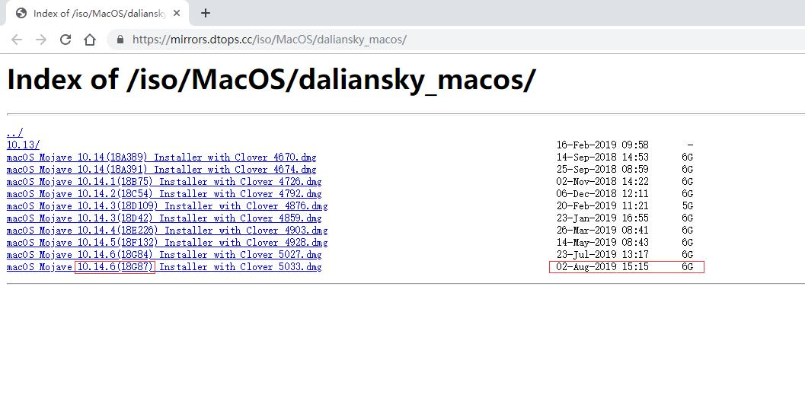
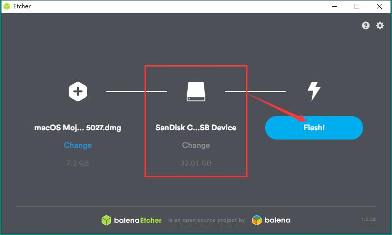
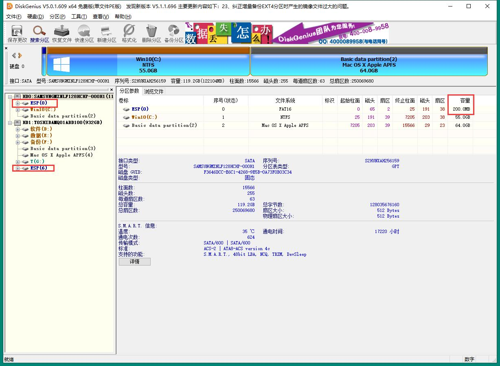
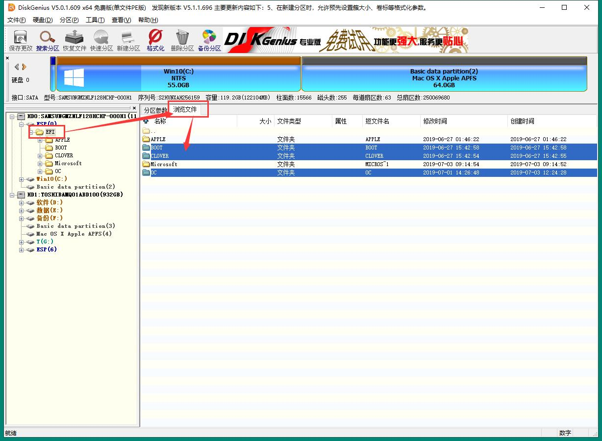
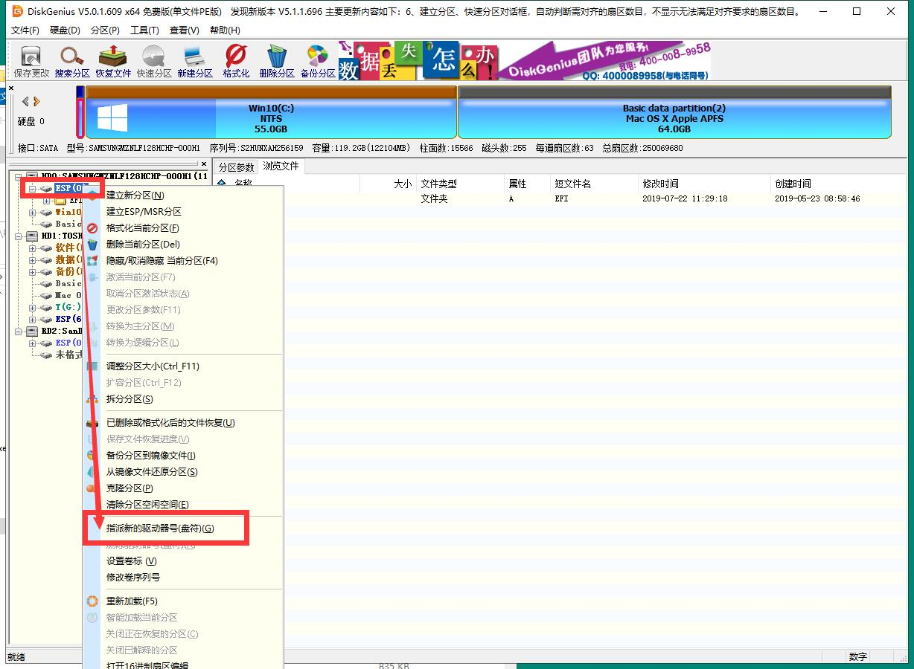
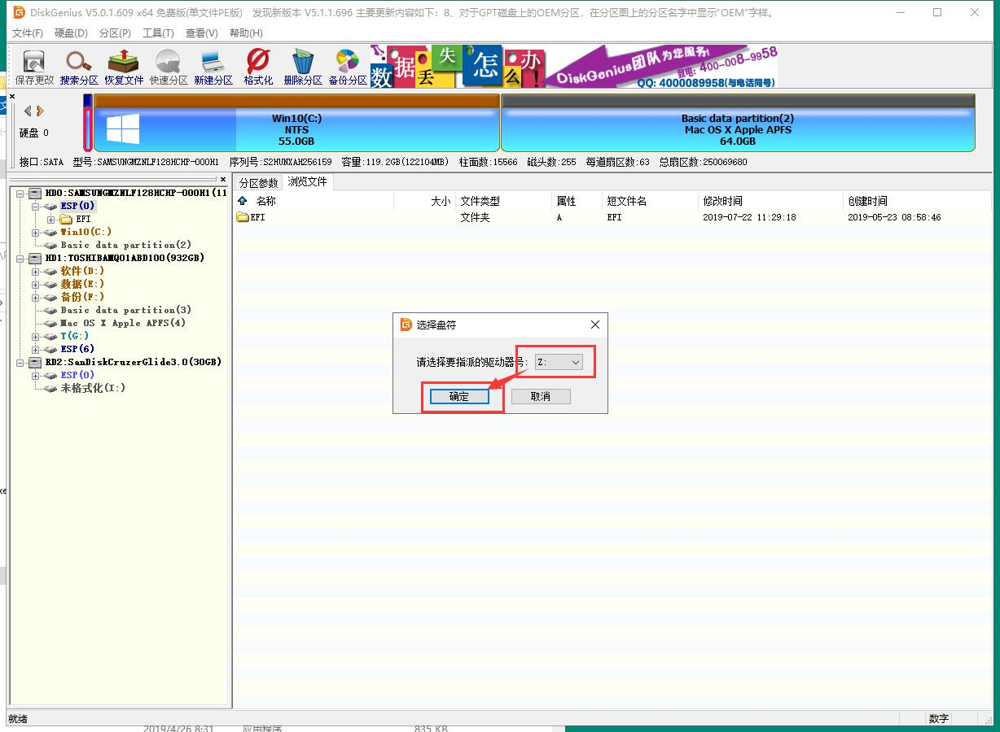
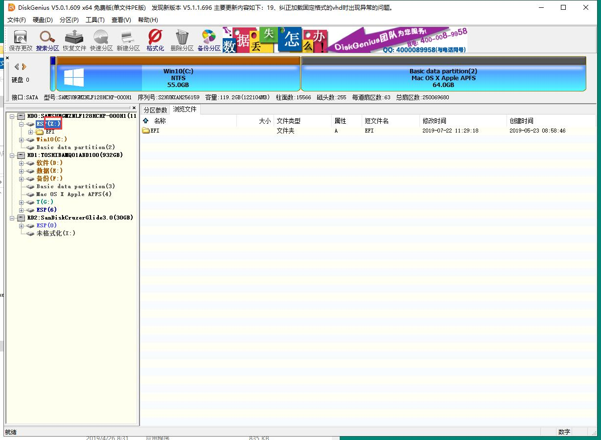
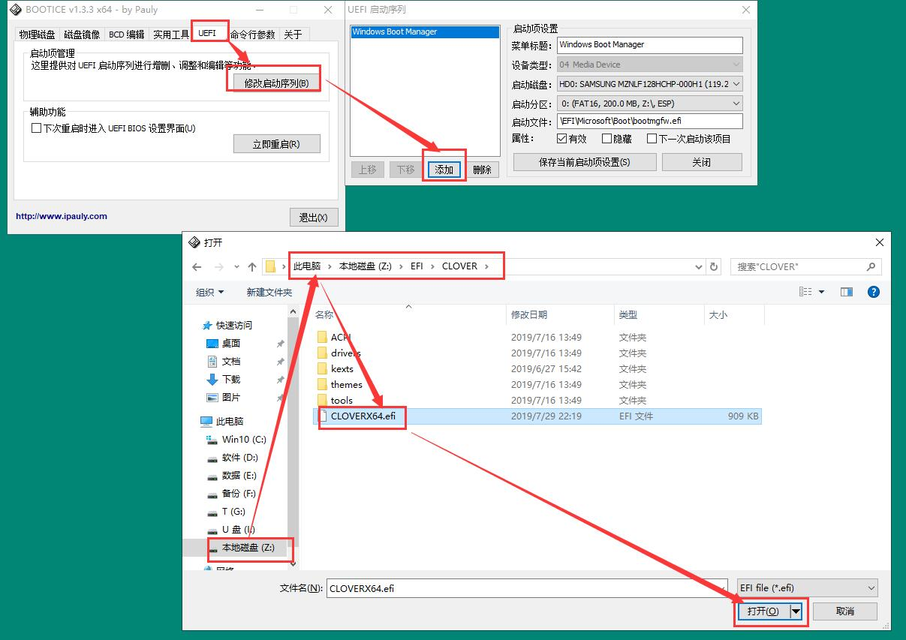
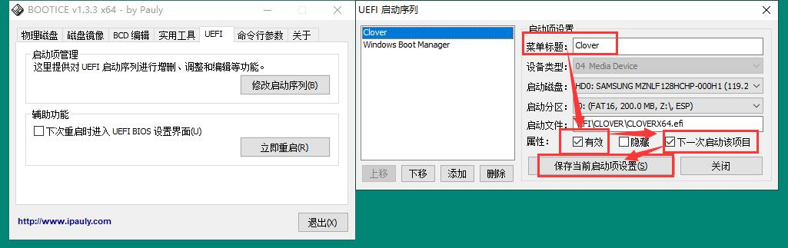
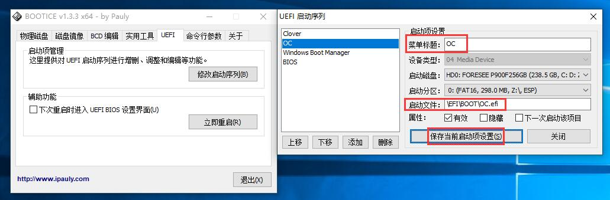

# Windows 下刻录U盘 macOS 安装镜像、添加 Clover 引导项、BIOS 设置引导教程（新手请务必按部就班仔细阅读！）

## macOS 安装镜像下载

## 下载安装镜像

使用黑果小兵的原版安装镜像：[【黑果小兵】macOS Mojave 10.14.6 18G87 正式版 with Clover 5033原版镜像](https://mirrors.dtops.cc/iso/MacOS/daliansky_macos/)

随着版本的更新迭代，可参考如图版本号、日期区分新旧版本。

## 刻录 U 盘安装镜像

直接使用 etcher 进行一键刻录：[etcher](https://www.balena.io/etcher/)

下载安装完成后打开并插入一个不小于 8GB 的 U盘，软件界面应该如下图，选择已经下载好的 DMG 安装镜像，检查 U盘是否正常识别，确认无误后点击“Flash！”，然后耐心等待完成。

## 下载已适配机型的 EFI 引导驱动

如果访问 GitHub 比较慢，可以到镜像地址下载：[码云](https://gitee.com/lgs3137/MR_S1-macOS)

## 安装已适配机型的 EFI 引导驱动

磁盘管理工具：[DiskGenius](http://www.diskgenius.cn/download.php)

1. 打开 DiskGenius 检查你现有 ESP 分区容量大小（如有多个硬盘建议安装Clover 引导在第一块硬盘），macOS 安装所在硬盘的 ESP 分区容量不得小于 200MB。如果小于 200MB，请想办法调整扩大。（一般可以在 PE 下用此工具调整 ESP 下一个分区的容量以达到扩容 ESP 分区，注意调整的时候选空出起始部分容量。）

2. 选择左边菜单栏 ESP 分区，右边菜单栏选择“浏览文件”，然后解压已下载好适配机型的 EFI 中的 3 个文件夹BOOT、CLOVER、OC并直接移动到右边“浏览文件”窗口中，如果你操作正常，会看到如图效果。

3. 确保 ESP 分区下的 EFI 文件存在BOOT、CLOVER、OC这 3 个文件夹后，右键左边菜单栏的 “ESP” 分区，选择“指派新的驱动器号(盘符)(G)”，然后从列表中选择任意一个盘符（如：Z）并确认（macOS 安装完毕后可以在此操作删除盘符）。最后检查左边菜单栏的 “ESP” 分区是否如图出现了刚选的盘符。

## 添加 Clover、OC 引导项

EFI 引导工具：[BOOTICE](http://8dx.pc6.com/xjq6/BOOTICE_Tool.zip)

1. 打开 BOOTICE 选择菜单栏“UEFI”，点击“修改启动序列(B)”，点击“添加”，在弹窗中选择刚刚分配的 Z 盘，并选中路径：EFI\CLOVER\CLOVERX64.efi 的文件，点击“打开”，然后在弹窗中修改“菜单标题”为“Clover”、勾选“有效”和“下载启动该项目”，最后点击“保存当前启动项设置”。
如果你不想使用 OC 引导macOS，可以不添加。

2. 重复上面的步骤，添加文件路径为：EFI\BOOT\BOOTX64.efi 的文件，修改标题为“OC”，点击“保存当前启动项设置”。

## BIOS 引导项设置

未完待续。。。

